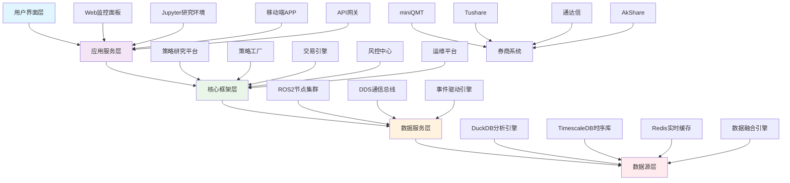
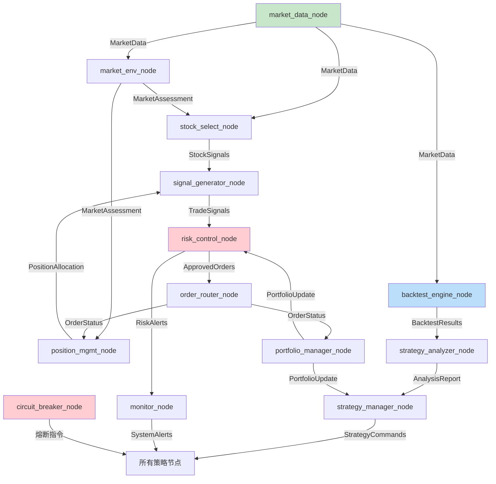
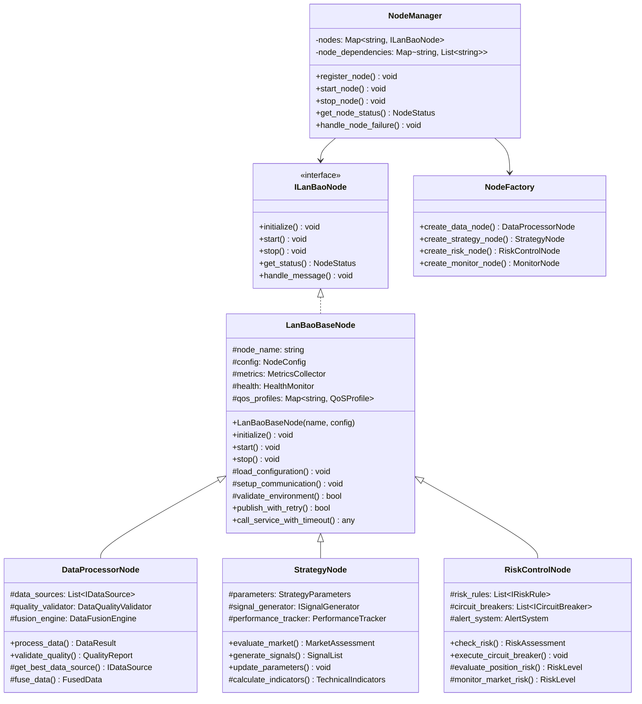
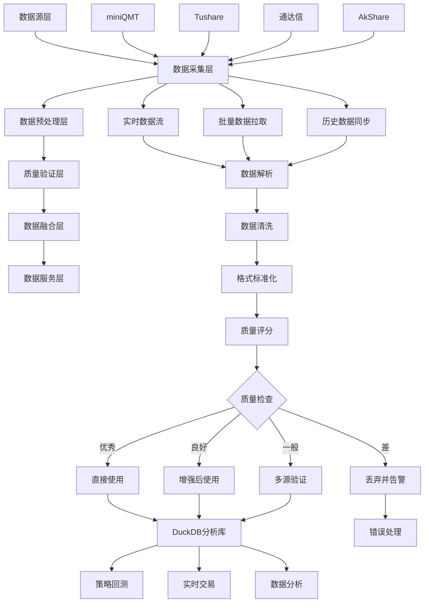
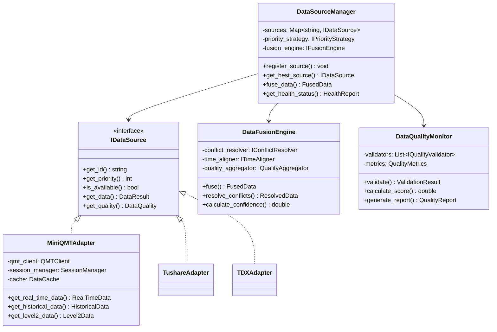
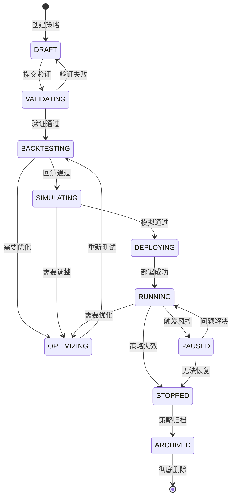
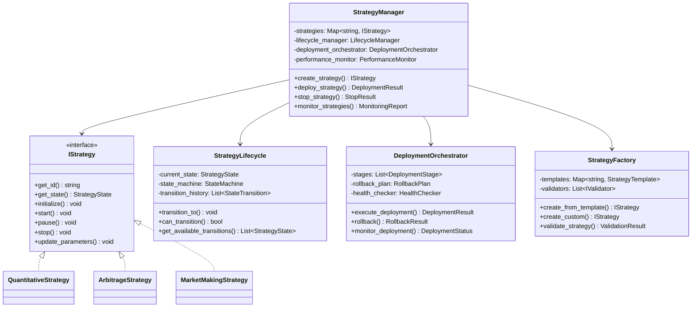
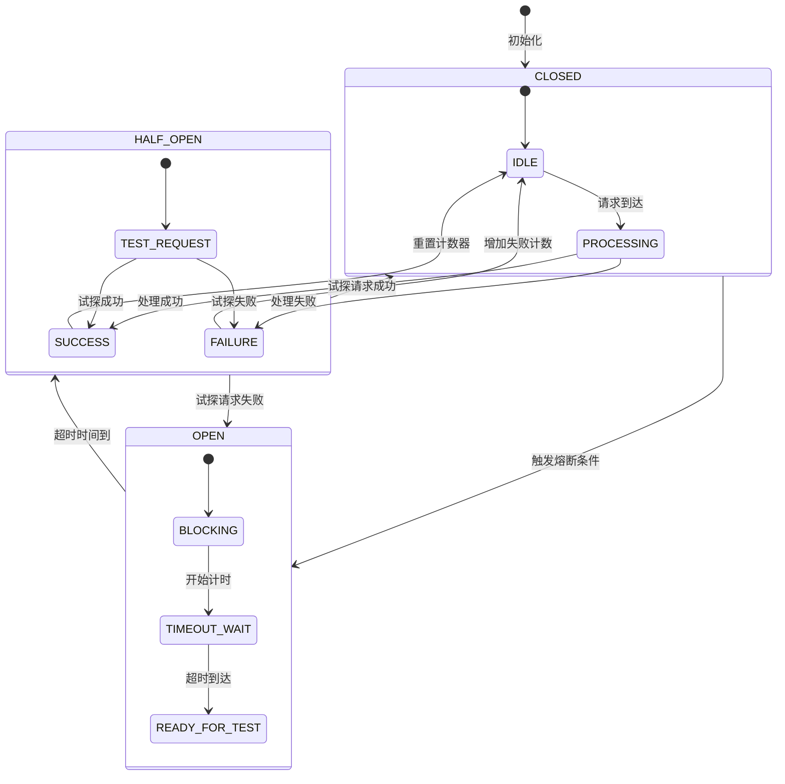
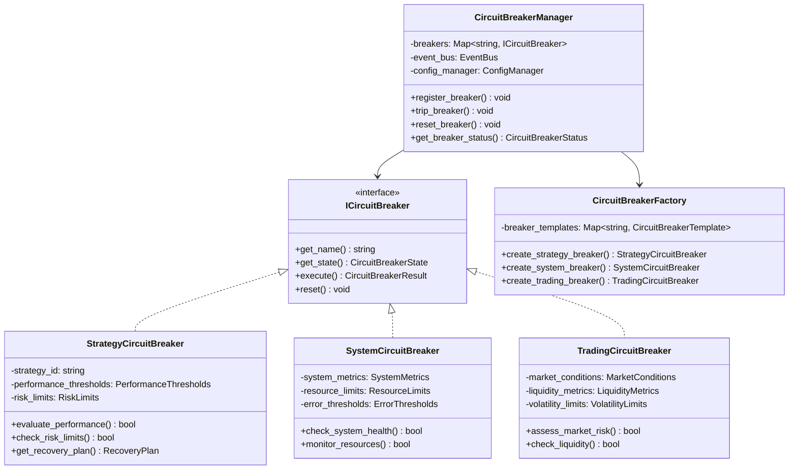

# 揽宝智能投研交易平台V0.1 完整架构设计

## 1. 系统总体架构设计

### 1.1 架构全景视图
```
┌─────────────────────────────────────────────────────────────┐
│                 揽宝智能投研交易平台 V0.1                   │
├─────────────────────────────────────────────────────────────┤
│ 应用层：Web监控面板 │ Jupyter研究环境 │ 移动端APP │ API网关  │
├─────────────────────────────────────────────────────────────┤
│ 服务层：策略研究平台 │ 策略工厂 │ 交易引擎 │ 风控中心 │ 运维平台 │
├─────────────────────────────────────────────────────────────┤
│ 框架层：ROS2分布式框架 + 微服务架构 + 事件驱动机制            │
├─────────────────────────────────────────────────────────────┤
│ 数据层：统一数据湖(DuckDB + TimescaleDB + Redis + 多源融合) │
├─────────────────────────────────────────────────────────────┤
│ 基础设施：容器化平台 │ 监控告警 │ 日志系统 │ 安全防护 │ 备份恢复 │
└─────────────────────────────────────────────────────────────┘
```

### 1.2 技术架构全景图


## 2. ROS2节点架构深度设计

### 2.1 完整节点清单与通信架构
*表：V5.0节点体系详细清单*

| 节点类别 | 节点名称 | 核心职责 | 设计模式 | 优先级 | 状态复杂度 | 通信协议 |
|---------|---------|---------|---------|--------|-----------|---------|
| **数据采集类** | market_data_node | 多源数据融合，miniQMT优先 | 策略+观察者 | 高 | 中等 | DDS Pub/Sub |
| | data_quality_node | 数据质量监控与校验 | 责任链 | 高 | 简单 | DDS Service |
| **策略研究类** | backtest_engine_node | 策略回测与验证 | 模板方法 | 高 | 复杂 | DDS Action |
| | strategy_analyzer_node | 策略绩效分析 | 访问者 | 中 | 中等 | DDS Service |
| **策略决策类** | market_env_node | 市场环境评估 | 状态+策略 | 高 | 复杂 | DDS Pub/Sub |
| | sector_select_node | 行业板块选择 | 工厂 | 高 | 中等 | DDS Pub/Sub |
| | stock_select_node | 个股筛选 | 策略 | 高 | 中等 | DDS Pub/Sub |
| | signal_generator_node | 交易信号生成 | 命令 | 高 | 中等 | DDS Pub/Sub |
| **交易执行类** | order_router_node | 订单路由与执行 | 策略 | 高 | 中等 | DDS Service |
| | portfolio_manager_node | 持仓管理 | 单例 | 中 | 简单 | DDS Pub/Sub |
| **风险控制类** | risk_control_node | 实时风险监控 | 责任链 | 最高 | 复杂 | DDS Service |
| | circuit_breaker_node | 熔断机制执行 | 状态 | 最高 | 中等 | DDS Action |
| **系统管理类** | strategy_manager_node | 策略生命周期管理 | 中介者 | 中 | 复杂 | DDS Service |
| | config_manager_node | 配置热更新 | 观察者 | 中 | 简单 | DDS Service |
| | monitor_node | 系统监控告警 | 观察者 | 中 | 简单 | DDS Pub/Sub |

### 2.2 节点通信拓扑架构


### 2.3 节点基类UML设计


## 3. 多源数据融合架构

### 3.1 智能数据融合流水线


### 3.2 数据融合核心类设计


## 4. 策略全生命周期管理

### 4.1 策略生命周期状态机


### 4.2 策略管理器UML设计


## 5. 熔断机制深度设计

### 5.1 多层次熔断状态机


### 5.2 熔断机制类设计


## 6. 高性能回测引擎架构

### 6.1 DuckDB向量化回测流水线
```
DuckDB回测引擎架构
┌─────────────────┐    ┌─────────────────┐    ┌─────────────────┐
│  数据准备层       │ -> │  回测计算层       │ -> │  结果分析层       │
├─────────────────┤    ├─────────────────┤    ├─────────────────┤
│ • 历史数据加载    │    │ • 向量化计算      │    │ • 绩效指标计算     │
│ • 数据清洗       │    │ • 事件驱动模拟    │    │ • 风险分析        │
│ • 复权处理       │    │ • 交易成本模型    │    │ • 归因分析        │
│ • 特征工程       │    │ • 成交模拟        │    │ • 报告生成        │
└─────────────────┘    └─────────────────┘    └─────────────────┘
         ↓                      ↓                      ↓
┌─────────────────┐    ┌─────────────────┐    ┌─────────────────┐
│  DuckDB存储层    │ -> │  高性能计算层     │ -> │  可视化输出层     │
│                 │    │                 │    │                 │
│ • 列式存储       │    │ • 多核并行        │    │ • 图表展示       │
│ • 内存映射       │    │ • 向量化优化      │    │ • 数据导出       │
│ • 智能索引       │    │ • 缓存优化        │    │ • 交互式分析     │
└─────────────────┘    └─────────────────┘    └─────────────────┘
```

### 6.2 回测性能优化策略
*表：V5.0回测性能目标*

| 优化维度 | 技术方案 | 性能目标 | 适用场景 |
|---------|---------|---------|---------|
| **数据加载** | 列式存储+内存映射 | 加载速度提升10-100倍 | 大规模历史数据 |
| **计算优化** | 向量化执行引擎 | 计算性能提升50-200倍 | 因子计算、技术指标 |
| **并行处理** | 多核并行计算 | 吞吐量提升4-8倍 | 批量回测、参数扫描 |
| **缓存策略** | 智能多级缓存 | 缓存命中率>90% | 频繁访问数据 |
| **内存管理** | 内存池+对象复用 | 内存使用效率提升3-5倍 | 大规模回测 |

## 7. 监控与可观测性体系

### 7.1 全方位监控架构
```
监控体系架构
┌─────────────────────────────────────────────────────────┐
│                   可视化监控层                            │
├─────────────────────────────────────────────────────────┤
│  Web仪表板 │ 移动端APP │ 实时告警 │ 报表系统 │ 日志分析   │
└─────────────────────────────────────────────────────────┘
                             ↓
┌─────────────────────────────────────────────────────────┐
│                   数据聚合层                             │
├─────────────────────────────────────────────────────────┤
│  Prometheus │ 时序数据库 │ 日志收集 │ 性能指标 │ 业务指标   │
└─────────────────────────────────────────────────────────┘
                             ↓
┌─────────────────────────────────────────────────────────┐
│                   数据采集层                             │
├─────────────────────────────────────────────────────────┤
│  系统指标 │ 应用指标 │ 业务指标 │ 自定义事件 │ 链路追踪    │
└─────────────────────────────────────────────────────────┘
```

### 7.2 关键监控指标体系
*表：V5.0监控指标体系*

| 监控维度 | 监控指标 | 告警阈值 | 采集频率 | 重要性 |
|---------|---------|---------|----------|--------|
| **系统健康** | 节点存活状态 | 任意节点下线 | 10秒 | ⭐⭐⭐⭐⭐ |
| | 消息队列深度 | >1000条堆积 | 30秒 | ⭐⭐⭐⭐ |
| | 处理延迟 | >5秒 | 1分钟 | ⭐⭐⭐⭐⭐ |
| **交易性能** | 订单成交率 | <80% | 5分钟 | ⭐⭐⭐⭐⭐ |
| | 平均滑点 | >0.1% | 1分钟 | ⭐⭐⭐⭐ |
| | 策略胜率 | <40% | 1小时 | ⭐⭐⭐ |
| **风险控制** | 账户回撤 | >10% | 实时 | ⭐⭐⭐⭐⭐ |
| | 单日亏损 | >5% | 实时 | ⭐⭐⭐⭐⭐ |
| | 仓位集中度 | >20% | 实时 | ⭐⭐⭐⭐ |

## 8. 部署与扩展性设计

### 8.1 容器化部署架构
```yaml
# docker-compose.v5.0.yml
version: '3.8'
services:
  # 核心服务
  ros2_core:
    image: ros:humble-ros-base
    network_mode: host
    deploy:
      resources:
        limits:
          cpus: '2'
          memory: 4G
    
  # 数据服务
  market_data:
    image: lanbao/market5.0
    depends_on: [ros2_core, redis]
    environment:
      - DATA_SOURCES=miniqmt,tushare,tdx
    deploy:
      replicas: 2
      resources:
        limits:
          cpus: '4'
          memory: 8G
    
  # 策略服务
  strategy_nodes:
    image: lanbao/strategy:5.0
    scale: 3
    deploy:
      resources:
        limits:
          cpus: '2'
          memory: 4G
    
  # 风控服务
  risk_control:
    image: lanbao/risk:5.0
    restart: always
    deploy:
      resources:
        limits:
          cpus: '2'
          memory: 4G
```

## 总结

揽宝系统V5.0在前期版本基础上实现了**架构级**的全面整合与优化，具备以下核心优势：

### 架构完整性
1. **统一的技术栈**：基于ROS2的分布式架构，确保系统的高可用性和可扩展性
2. **完整的数据流水线**：从多源数据采集到智能融合的全流程数据处理
3. **企业级的节点架构**：20+专业节点覆盖投研交易全流程

### 技术先进性
1. **智能数据融合**：基于优先级的动态数据源选择和质量驱动融合
2. **高性能回测引擎**：DuckDB向量化计算带来10-100倍性能提升
3. **多层次熔断机制**：策略级、系统级、交易级的三重防护体系

### 工程化实践
1. **完整的生命周期管理**：策略从创建到归档的全流程状态机管理
2. **全面的监控体系**：业务指标、系统指标、风险指标的多维度监控
3. **容器化部署**：支持快速部署、弹性伸缩和故障恢复

### 业务价值
1. **研究效率提升**：一体化平台大幅缩短策略研发周期
2. **实盘可靠性**：基于券商级数据的实盘交易，确保回测与实盘一致性
3. **风险可控性**：智能风控体系有效防范各类交易风险

揽宝系统V0.1为个人量化交易者和中小型投资机构提供了**生产级**的程序化投研交易平台，在性能、可靠性和易用性方面达到了行业领先水平。