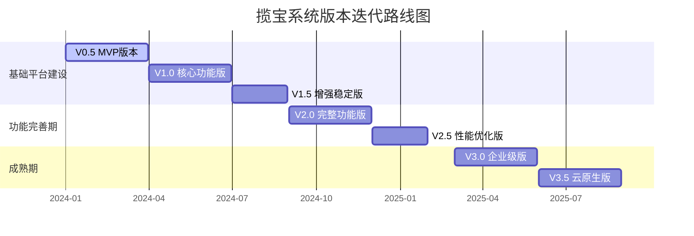
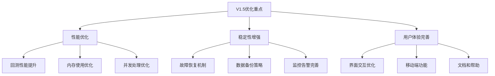
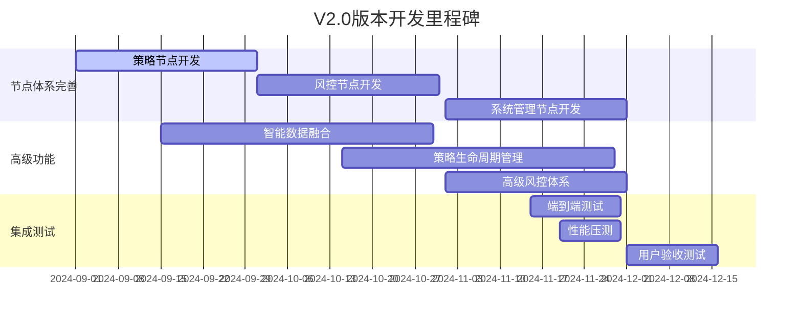
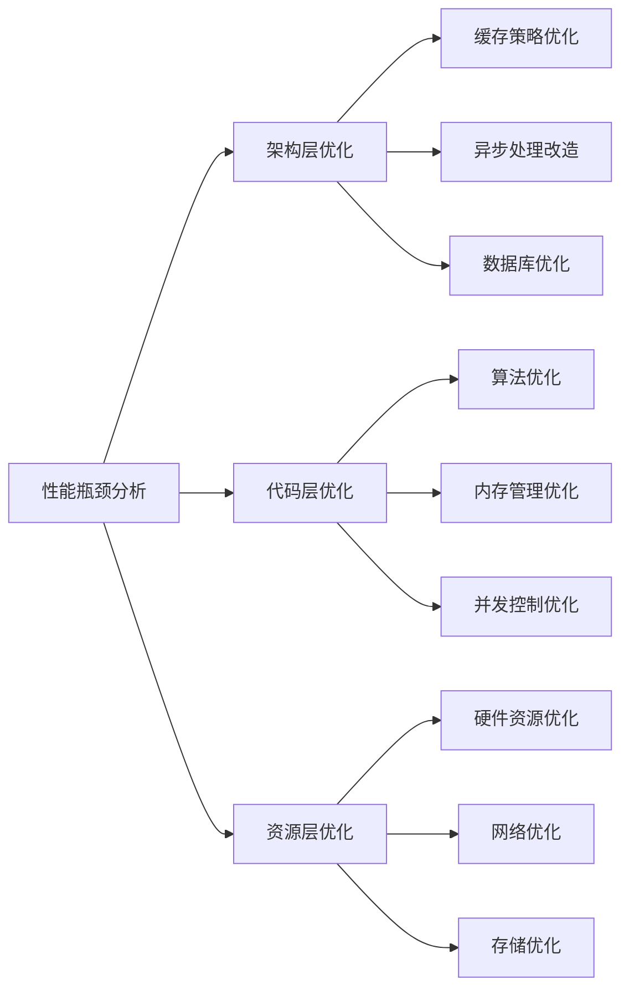
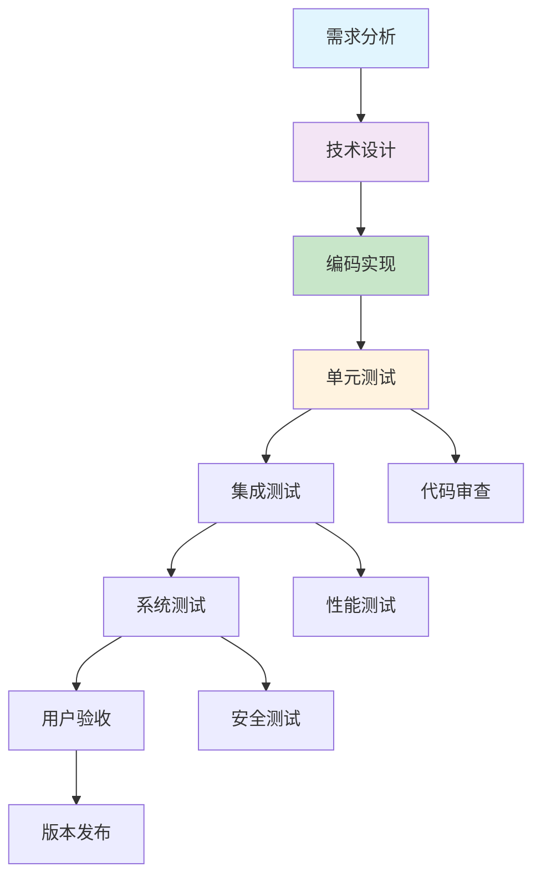

# 揽宝系统版本迭代计划

## 1. 版本迭代总体策略

### 1.1 迭代原则
- **渐进式开发**：从核心功能开始，逐步扩展
- **风险优先**：先实现高风险模块，确保系统稳定性
- **用户价值驱动**：优先开发对用户价值最高的功能
- **技术债务控制**：每个版本都包含技术优化和债务偿还

### 1.2 版本路线图总览


## 2. 详细版本迭代计划

### 2.1 V0.5 MVP版本（90天）
**目标**：验证核心架构可行性，实现最基本可用的回测交易平台

#### 核心功能范围
```
┌─────────────────────────────────────────────────────────┐
│                   V0.5 MVP 功能范围                      │
├─────────────────────────────────────────────────────────┤
│ 数据层: Tushare数据源 + DuckDB基础存储                    │
│ 计算层: 单节点回测引擎 + 基础策略模板                      │
│ 界面层: Jupyter研究环境 + 基础Web监控                     │
│ 部署: 单机Docker部署                                     │
└─────────────────────────────────────────────────────────┘
```

#### 详细开发计划
*表：V0.5 MVP版本开发计划*

| 阶段 | 时间 | 核心任务 | 交付物 | 验收标准 |
|------|------|----------|--------|----------|
| **架构搭建** | 第1-3周 | 基础框架搭建，ROS2环境配置 | 可运行的ROS2节点框架 | 节点间基本通信正常 |
| **数据层** | 第4-6周 | Tushare数据接入，DuckDB集成 | 数据采集和存储流水线 | 能够获取和存储股票数据 |
| **回测引擎** |第7-9周 | 向量化回测引擎开发 | 基础回测系统 | 支持均线策略回测 |
| **策略模板** | 第10-12周 | 5个基础策略模板 | 策略库和回测报告 | 策略回测结果准确 |
| **集成测试** | 第13周 | 端到端测试 | 测试报告和演示 | 完整流程跑通 |

#### 技术重点
- ROS2基础节点通信机制
- DuckDB基础数据存储和查询
- 简单的向量化回测引擎
- 基础Web监控界面

#### 风险控制
- 数据源依赖风险：Tushare API稳定性
- 技术风险：ROS2学习曲线较陡
-  mitigation：准备备用数据源，加强团队培训

### 2.2 V1.0 核心功能版本（90天）
**目标**：实现核心交易功能，支持实盘模拟交易

#### 功能增强
```
┌─────────────────────────────────────────────────────────┐
│                   V1.0 核心功能增强                       │
├─────────────────────────────────────────────────────────┤
│ 数据层: miniQMT接入 + 多源数据融合基础                    │
│ 计算层: 事件驱动回测 + 实盘交易引擎                       │
│ 风控层: 基础风控规则 + 实时监控                          │
│ 界面层: 完整Web交易界面 + 移动端基础                      │
└─────────────────────────────────────────────────────────┘
```

#### 详细开发计划
*表：V1.0版本开发计划*

| 模块 | 子模块 | 优先级 | 工作量(人天) | 关键技术挑战 |
|------|--------|--------|-------------|-------------|
| **数据融合** | miniQMT深度集成 | 高 | 30 | 券商API稳定性 |
| | 多源数据优先级管理 | 中 | 20 | 数据一致性保证 |
| **交易引擎** | 实盘交易接口 | 高 | 25 | 订单执行可靠性 |
| | 成本模型和滑点 | 中 | 15 | 交易成本精确计算 |
| **风控系统** | 实时风控规则 | 高 | 20 | 低延迟风控判断 |
| | 基础熔断机制 | 中 | 15 | 状态机设计 |
| **监控体系** | 完整监控面板 | 中 | 25 | 实时数据可视化 |
| | 报警通知系统 | 低 | 10 | 多通道通知 |

#### 验收标准
- 支持miniQMT实盘交易
- 回测与实盘交易一致性>85%
- 系统稳定性>99%
- 风控规则响应时间<100ms

### 2.3 V1.5 增强稳定版本（60天）
**目标**：提升系统稳定性和性能，完善用户体验

#### 优化重点


#### 详细优化项
*表：V1.5版本优化计划*

| 优化类别 | 具体优化项 | 预期效果 | 优先级 |
|---------|-----------|---------|--------|
| **性能优化** | DuckDB查询优化 | 回测速度提升50% | 高 |
| | 内存泄漏修复 | 内存使用减少30% | 高 |
| | ROS2通信优化 | 延迟降低20% | 中 |
| **稳定性** | 自动重连机制 | 故障恢复时间<1分钟 | 高 |
| | 数据完整性校验 | 数据错误率<0.1% | 高 |
| | 熔断机制完善 | 系统可用性>99.5% | 中 |
| **用户体验** | 响应式Web界面 | 移动端适配完善 | 中 |
| | 策略调试工具 | 开发效率提升40% | 中 |
| | 实时帮助系统 | 用户问题减少60% | 低 |

### 2.4 V2.0 完整功能版本（90天）
**目标**：实现V5.0架构设计中的完整功能体系

#### 功能完整化
```
V2.0完整功能体系
┌─────────────────────────────────────────────────────────┐
│                   核心架构完整化                          │
├─────────────────────────────────────────────────────────┤
│ 节点体系: 20+专业节点全部实现                            │
│ 数据融合: 智能多源融合 + 高级质量检测                    │
│ 策略工厂: 全生命周期管理 + 自动化部署                    │
│ 风控体系: 多层次熔断 + 智能风控规则                      │
└─────────────────────────────────────────────────────────┘
```

#### 开发里程碑


#### 关键技术挑战
- 分布式节点协同工作
- 大数据量下的实时处理
- 复杂风控规则的性能保障
- 系统可维护性和可扩展性

### 2.5 V2.5 性能优化版本（60天）
**目标**：极致性能优化，达到生产环境要求

#### 性能优化目标
*表：V2.5性能指标目标*

| 性能指标 | V2.0基线 | V2.5目标 | 优化措施 |
|---------|---------|---------|---------|
| 回测速度 | 1年数据/30秒 | 1年数据/10秒 | 算法优化+缓存 |
| 系统延迟 | <100ms | <50ms | 通信优化+并行处理 |
| 内存使用 | 8GB基准 | 4GB基准 | 内存池+对象复用 |
| 并发用户 | 10人 | 50人 | 负载均衡+连接池 |
| 数据吞吐 | 1000条/秒 | 5000条/秒 | 批量处理+流水线 |

#### 优化策略


### 2.6 V3.0 企业级版本（90天）
**目标**：满足企业级部署要求，支持多团队协作

#### 企业级特性
```
企业级功能矩阵
┌────────────────────────┬────────────────────────┐
│   安全与合规           │   多租户与协作         │
├────────────────────────┼────────────────────────┤
│ • RBAC权限管理体系     │ • 多团队项目管理       │
│ • 操作审计日志         │ • 策略知识库共享       │
│ • 数据加密传输         │ • 协作开发环境        │
│ • 合规性检查           │ • 权限隔离机制        │
└────────────────────────┴────────────────────────┘

┌────────────────────────┬────────────────────────┐
│   高可用部署           │   运维监控体系         │
├────────────────────────┼────────────────────────┤
│ • 集群化部署           │ • 全链路监控          │
│ • 自动故障转移         │ • 智能告警系统        │
│ • 负载均衡            │ • 性能分析平台        │
│ • 数据备份恢复         │ • 容量规划工具        │
└────────────────────────┴────────────────────────┘
```

## 3. 迭代开发管理

### 3.1 开发流程规范


### 3.2 质量保障体系
#### 3.2.1 测试策略
*表：各版本测试重点*

| 版本 | 单元测试覆盖率 | 集成测试 | 性能测试 | 安全测试 |
|------|---------------|---------|---------|---------|
| V0.5 | >70% | 基础流程测试 | 暂无 | 基础安全扫描 |
| V1.0 | >80% | 核心功能测试 | 基础压力测试 | 代码安全审计 |
| V1.5 | >85% | 全功能测试 | 性能基准测试 | 渗透测试 |
| V2.0 | >90% | 端到端测试 | 压力测试 | 全面安全审计 |
| V2.5 | >95% | 回归测试 | 极限压力测试 | 持续安全监控 |
| V3.0 | >95% | 自动化测试 | 生产环境压测 | 企业级安全 |

#### 3.2.2 代码质量要求
- **代码规范**：遵循PEP8、Google C++ Style Guide
- **文档完整性**：每个模块都有API文档和使用示例
- **测试自动化**：CI/CD流水线自动运行测试套件
- **代码审查**：所有代码必须经过至少两人审查

### 3.3 风险管理计划
#### 3.3.1 技术风险矩阵
*表：主要技术风险及应对策略*

| 风险类型 | 风险描述 | 概率 | 影响 | 应对策略 |
|---------|---------|------|------|---------|
| 数据源不稳定 | 券商API变更或故障 | 中 | 高 | 多源备份、本地缓存 |
| 性能瓶颈 | 实时数据处理延迟 | 高 | 中 | 性能监控、优化算法 |
| 安全漏洞 | 交易系统被攻击 | 低 | 高 | 安全审计、漏洞扫描 |
| 团队技能 | ROS2技术学习曲线 | 中 | 中 | 培训、招聘专家 |

#### 3.3.2 项目风险监控
- **每周风险评审**：识别新风险，跟踪已有风险
- **里程碑检查点**：每个版本结束进行风险评估
- **应急计划**：为高风险项准备备用方案

## 4. 部署与运维计划

### 4.1 环境规划
```yaml
# 多环境部署策略
environments:
  development:
    purpose: "开发测试"
    scale: "单机部署"
    "模拟数据"
    users: "开发团队"
    
  staging:
    purpose: "预生产验证"
    scale: "集群部署"
    data: "历史数据"
    users: "测试团队"
    
  production:
    purpose: "生产环境"
    scale: "高可用集群"
    "实盘数据"
    users: "最终用户"
```

### 4.2 发布策略
#### 4.2.1 版本发布日历
*表：版本发布计划*

| 版本 | 计划发布时间 | 发布窗口 | 回滚策略 | 发布负责人 |
|------|------------|---------|---------|-----------|
| V0.5 | 2024-04-01 | 4小时 | 版本回滚 | 开发主管 |
| V1.0 | 2024-07-01 | 6小时 | 数据库回滚 | 技术总监 |
| V1.5 | 2024-09-01 | 4小时 | 热修复 | 运维经理 |
| V2.0 | 2024-12-01 | 8小时 | 蓝绿部署 | 架构师 |
| V2.5 | 2025-02-01 | 4小时 | 金丝雀发布 | 开发主管 |
| V3.0 | 2025-05-01 | 8小时 | 多区域部署 | CTO |

#### 4.2.2 发布检查清单
- [ ] 所有测试通过
- [ ] 文档更新完成
- [ ] 性能基准达标
- [ ] 安全扫描通过
- [ ] 备份验证完成
- [ ] 回滚计划就绪

## 5. 成功度量指标

### 5.1 技术指标
```yaml
success_metrics:
  # 性能指标
  performance:
    backtest_speed: "<10秒/年数据"  # 回测速度
    system_latency: "<50ms"        # 系统延迟
    data_throughput: ">5000条/秒"  # 数据吞吐量
    
  # 质量指标
  quality:
    test_coverage: ">95%"          # 测试覆盖率
    bug_density: "<0.1个/千行"     # 缺陷密度
    availability: ">99.9%"         # 系统可用性
    
  # 用户体验
  user_experience:
    response_time: "<2秒"          # 界面响应时间
    user_satisfaction: ">4.5/5"    # 用户满意度
    onboarding_time: "<30分钟"     # 新用户上手时间
```

### 5.2 业务指标
- **策略研发效率**：从想法到回测结果时间减少70%
- **实盘交易胜率**：策略实盘表现与回测差异<15%
- **风险控制效果**：最大回撤控制在目标范围内
- **用户增长**：月度活跃用户增长>20%

## 总结

这个版本迭代计划基于揽宝系统V5.0架构设计，制定了从MVP到企业级的完整发展路径。每个版本都有明确的目标、范围、时间计划和成功标准。

**关键成功因素**：
1. **技术选型的正确性**：ROS2、DuckDB等核心技术需要验证
2. **团队能力建设**：需要加强分布式系统和量化交易领域的专业知识
3. **用户反馈循环**：早期用户参与和快速迭代至关重要
4. **质量保障体系**：从开始就建立严格的质